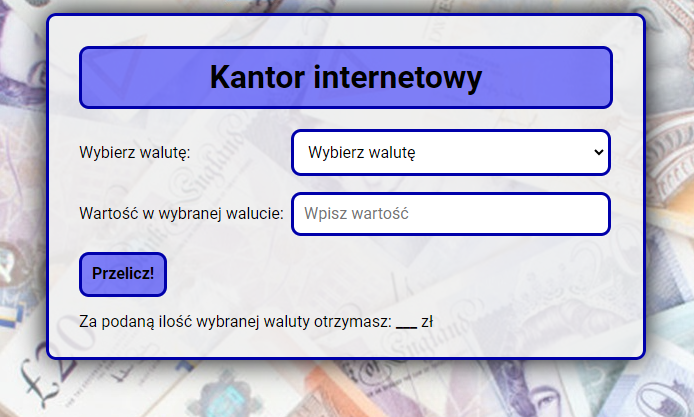

# #02 Currency converter
Currency converter app to quickly and easily convert amounts between different currencies.

## 📝 Features:
- possibility of converting PLN into a selected currency
- available currencies to choose from:
    - Euro (EUR)
    - US dollar (USD)
    - British Pound (GBP)
    - Swiss Franc (CHF)
- quickly convert amounts from one currency to another

## 🔗 Demo:
https://pevu96.github.io/currency-converter/

## 👨🏻‍💻 Technologies:
- HTML
- CSS
    - Alternative Box Model
    - Normalize.css
- JavaScript
    - ECMAScript 6

## ✍️ Author
This project was created by Patryk Wernerowicz.